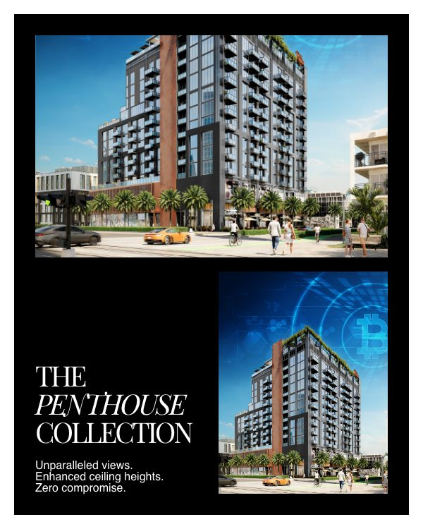
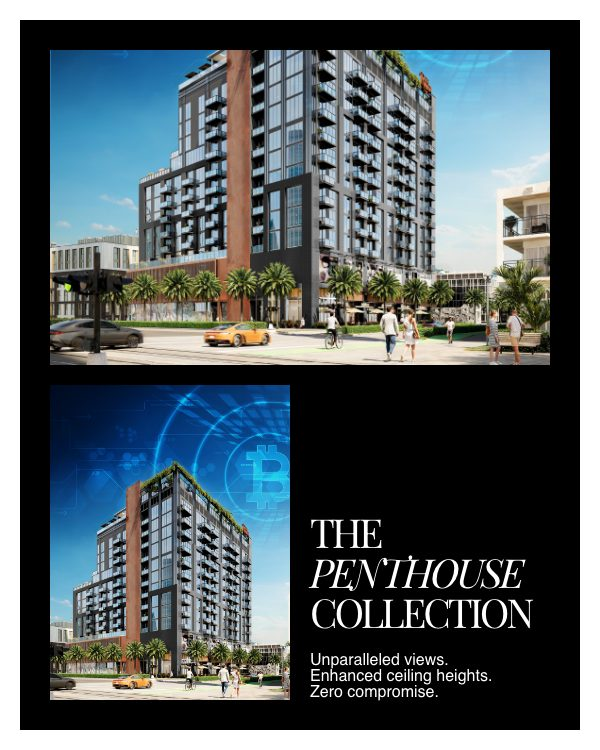
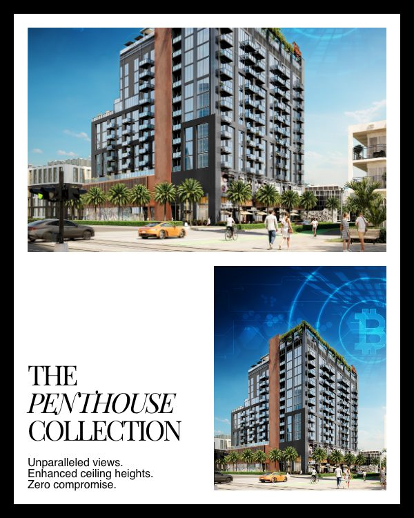
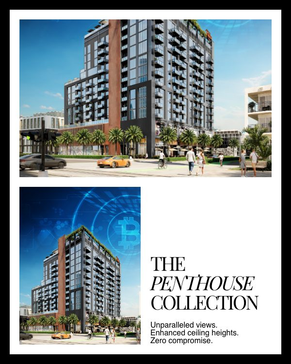
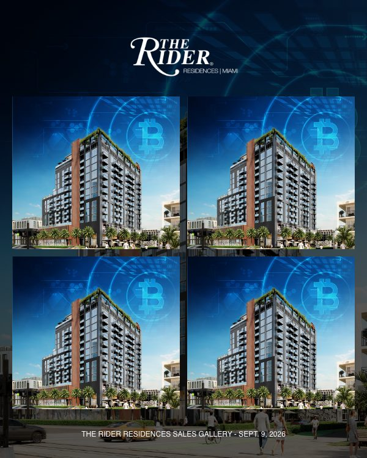
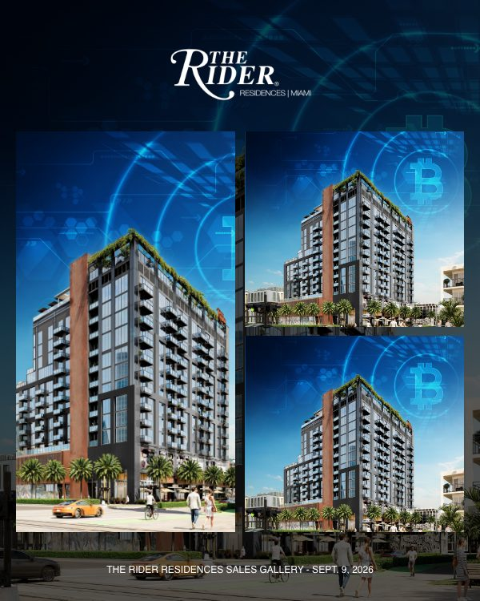
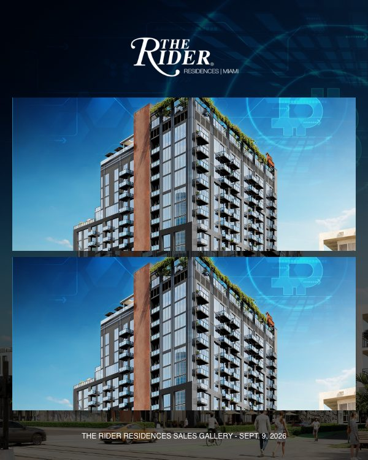
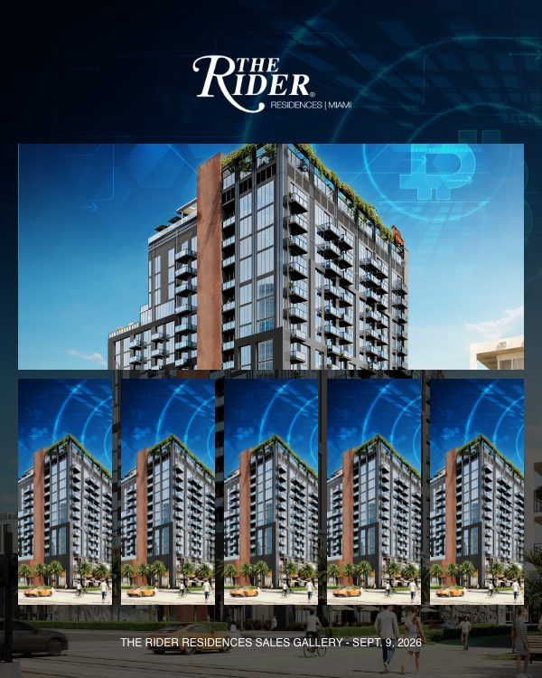
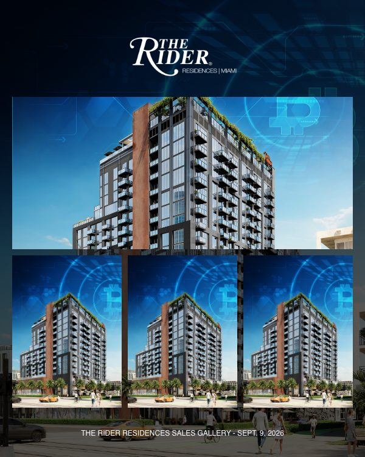

# The Rider Social Scaffold: Frame Catalog

**Status:** Imported; owner review pending

Generated by `tools/social_scaffold/import_scaffold.cjs`. Do not edit by hand; re-run the import instead.

- Source: `http://start-up.local/social-scaffolding/`, imported 2026-10-09
- Frames: 33, each 600x750 px, exported at 2x as 1200x1500 px
- Cleaning: kept 541 of 1753 CSS rules
- Verification: 685 elements compared against the live page on 63 computed properties plus box geometry, 0 differences

## How To Read This

- **ID** is assigned by position within each family: `SP` single posts, `SC` carousel frames, `SG` photo gallery set. Adding a line such as `ID: SP-07` to a frame's green label in Elementor pins that ID across re-imports.
- **Slots** come from the CSS, not the label. `background` is an image covering the canvas, `image-N` is a smaller image area, and text slots are named by role.
- **Label** is the owner's green-bar text. A scrim line that says radial over a linear scrim is rewritten on import to name the actual scrim; **Notes** records the original wording and any other place the label and the CSS disagree.
- Every image slot currently points at one placeholder image.
- 26 of 33 END markers read "END - POST FRAME START"; frames are paired by position, so this does not affect the import.

## Single posts (SP)

| ID | Preview | Layout | Slots | Label | Notes |
| --- | --- | --- | --- | --- | --- |
| SP-01 |  | Framed, 20px black border Logo top right No overlay | `background` 600x750 portrait `heading` Helvetica 28px, top left | FRAMED LAYOUT TWO-COLUMN HEADER - HEADLINE ON LEFT, LOGO ON RIGHT AI GENERATED IMAGE FROM PROMPT OR PROVIDED BY THE USER | None |
| SP-02 |  | Framed, 20px black border Logo top center Overlay: linear scrim, darkest at top | `background` 600x660 portrait `heading` Helvetica 34px, top center | FRAMED LAYOUT ONE-COLUMN HEADER - LOGO CENTERED AI GENERATED IMAGE BASED FROM PROMPT OR PROVIDED BY THE USER SCRIM GRADIENT OVERLAY ON BACKGROUND IMAGE HEADING TOP CENTER-ALIGNED | None |
| SP-03 |  | Framed, 20px black border Logo top center Overlay: linear scrim, darkest at bottom | `background` 600x660 portrait `heading` Helvetica 34px, bottom left | FRAMED LAYOUT ONE-COLUMN HEADER - LOGO CENTERED AI GENERATED IMAGE BASED FROM PROMPT OR PROVIDED BY THE USER SCRIM GRADIENT OVERLAY ON BACKGROUND IMAGE HEADING BOTTOM LEFT-ALIGNED | None |
| SP-04 |  | Framed, 20px black border Logo top center Overlay: linear scrim, darkest at top | `background` 600x660 portrait `heading` Helvetica 34px, top center `subheading` Playfair Display 34px, top center | FRAMED LAYOUT ONE-COLUMN HEADER - LOGO CENTERED AI GENERATED IMAGE BASED FROM PROMPT OR PROVIDED BY THE USER SCRIM GRADIENT OVERLAY ON BACKGROUND IMAGE HEADING AND SUBHEADING TOP CENTER-ALIGNED | Same label as SP-05. |
| SP-05 |  | Framed, 20px black border Logo top center Overlay: linear scrim, darkest at bottom | `background` 600x660 portrait `heading` Helvetica 34px, bottom left `subheading` Playfair Display 34px, bottom left | FRAMED LAYOUT ONE-COLUMN HEADER - LOGO CENTERED AI GENERATED IMAGE BASED FROM PROMPT OR PROVIDED BY THE USER SCRIM GRADIENT OVERLAY ON BACKGROUND IMAGE HEADING AND SUBHEADING TOP CENTER-ALIGNED | Same label as SP-04. |
| SP-06 |  | Framed, 20px black border Logo top center Overlay: linear scrim, darkest at top | `background` 600x750 portrait `heading` Helvetica 34px, top center `subheading` Playfair Display 34px, top center | FRAMED LAYOUT ONE-COLUMN LOGO CENTERED, HEADING AND SUBHEADING WITHIN THE BODY AI GENERATED IMAGE BASED FROM PROMPT OR PROVIDED BY THE USER SCRIM GRADIENT OVERLAY ON BACKGROUND IMAGE HEADING AND SUBHEADING TOP CENTER-ALIGNED | None |
| SP-07 |  | Framed, 20px black border Logo top center Overlay: linear scrim, darkest at bottom | `background` 600x750 portrait `heading` Helvetica 34px, bottom center `subheading` Playfair Display 34px, bottom center | FRAMED LAYOUT ONE-COLUMN LOGO CENTERED, HEADING AND SUBHEADING WITHIN THE BODY AI GENERATED IMAGE BASED FROM PROMPT OR PROVIDED BY THE USER SCRIM GRADIENT OVERLAY ON BACKGROUND IMAGE HEADING AND SUBHEADING BOTTOM CENTER-ALIGNED | None |
| SP-08 |  | Framed, 20px black border Logo top center Overlay: linear scrim, darkest at bottom | `background` 600x750 portrait `heading` Helvetica 34px, bottom left `subheading` Playfair Display 34px, bottom left | FRAMED LAYOUT ONE-COLUMN LOGO CENTERED, HEADING AND SUBHEADING WITHIN THE BODY AI GENERATED IMAGE BASED FROM PROMPT OR PROVIDED BY THE USER SCRIM GRADIENT OVERLAY ON BACKGROUND IMAGE HEADING AND SUBHEADING BOTTOM LEFT-ALIGNED | Same label as SP-10. |
| SP-09 |  | Framed, 20px black border Logo top center Overlay: radial scrim | `background` 600x750 portrait `heading` Helvetica 34px, middle center `subheading` Playfair Display 34px, middle center | FRAMED LAYOUT ONE-COLUMN LOGO CENTERED, HEADING AND SUBHEADING WITHIN THE BODY AI GENERATED IMAGE BASED FROM PROMPT OR PROVIDED BY THE USER CENTERED SCRIM RADIAL GRADIENT OVERLAY ON BACKGROUND IMAGE HEADING AND SUBHEADING CENTER-CENTERE | None |
| SP-10 |  | Framed, 20px black border Logo top center Overlay: linear scrim, darkest at bottom | `background` 600x750 portrait `heading` Helvetica 34px, bottom left `subheading` Playfair Display 34px, bottom left | FRAMED LAYOUT ONE-COLUMN LOGO CENTERED, HEADING AND SUBHEADING WITHIN THE BODY AI GENERATED IMAGE BASED FROM PROMPT OR PROVIDED BY THE USER SCRIM GRADIENT OVERLAY ON BACKGROUND IMAGE HEADING AND SUBHEADING BOTTOM LEFT-ALIGNED | Same label as SP-08. |
| SP-11 |  | Edge to edge Logo top center Overlay: linear scrim, darkest at top | `background` 600x750 portrait `heading` Helvetica 34px, top center | UNFRAMED, EDGE-TO-EDGE LAYOUT ONE-COLUMN LOGO CENTERED, HEADING AND SUBHEADING WITHIN THE BODY AI GENERATED IMAGE BASED FROM PROMPT OR PROVIDED BY THE USER LINEAR SCRIM GRADIENT OVERLAY ON BACKGROUND IMAGE - DARKEST AT TOP HEADING AND SUBHEADING TOP CENTER-ALIGNED | Label corrected on import; the page says "CENTERED SCRIM RADIAL GRADIENT OVERLAY ON BACKGROUND IMAGE". Same label as SP-13. |
| SP-12 |  | Edge to edge Logo top center Overlay: linear scrim, darkest at bottom | `background` 600x750 portrait `heading` Helvetica 34px, bottom left | UNFRAMED, EDGE-TO-EDGE LAYOUT ONE-COLUMN LOGO CENTERED, HEADING AND SUBHEADING WITHIN THE BODY AI GENERATED IMAGE BASED FROM PROMPT OR PROVIDED BY THE USER LINEAR SCRIM GRADIENT OVERLAY ON BACKGROUND IMAGE - DARKEST AT BOTTOM HEADING AND SUBHEADING TOP CENTER-ALIGNED | Label corrected on import; the page says "CENTERED SCRIM RADIAL GRADIENT OVERLAY ON BACKGROUND IMAGE". |
| SP-13 |  | Edge to edge Logo top center Overlay: linear scrim, darkest at top | `background` 600x750 portrait `heading` Helvetica 34px, top center `subheading` Playfair Display 34px, middle center | UNFRAMED, EDGE-TO-EDGE LAYOUT ONE-COLUMN LOGO CENTERED, HEADING AND SUBHEADING WITHIN THE BODY AI GENERATED IMAGE BASED FROM PROMPT OR PROVIDED BY THE USER LINEAR SCRIM GRADIENT OVERLAY ON BACKGROUND IMAGE - DARKEST AT TOP HEADING AND SUBHEADING TOP CENTER-ALIGNED | Label corrected on import; the page says "CENTERED SCRIM RADIAL GRADIENT OVERLAY ON BACKGROUND IMAGE". Same label as SP-11. |
| SP-14 |  | Edge to edge Logo top center Overlay: linear scrim, darkest at bottom | `background` 600x750 portrait `heading` Helvetica 34px, bottom center `subheading` Playfair Display 34px, bottom center | UNFRAMED, EDGE-TO-EDGE LAYOUT ONE-COLUMN LOGO CENTERED, HEADING AND SUBHEADING WITHIN THE BODY AI GENERATED IMAGE BASED FROM PROMPT OR PROVIDED BY THE USER LINEAR SCRIM GRADIENT OVERLAY ON BACKGROUND IMAGE - DARKEST AT BOTTOM HEADING AND SUBHEADING BOTTOM CENTER-ALIGNED | Label corrected on import; the page says "CENTERED SCRIM RADIAL GRADIENT OVERLAY ON BACKGROUND IMAGE". |
| SP-15 |  | Edge to edge Logo top center Overlay: linear scrim, darkest at bottom | `background` 600x750 portrait `heading` Helvetica 34px, bottom left `subheading` Playfair Display 34px, bottom left | UNFRAMED, EDGE-TO-EDGE LAYOUT ONE-COLUMN LOGO CENTERED, HEADING AND SUBHEADING WITHIN THE BODY AI GENERATED IMAGE BASED FROM PROMPT OR PROVIDED BY THE USER LINEAR SCRIM GRADIENT OVERLAY ON BACKGROUND IMAGE - DARKEST AT BOTTOM HEADING AND SUBHEADING BOTTOM LEFT-ALIGNED | Label corrected on import; the page says "CENTERED SCRIM RADIAL GRADIENT OVERLAY ON BACKGROUND IMAGE". |
| SP-16 |  | Edge to edge Logo top center Overlay: radial scrim | `background` 600x750 portrait `heading` Helvetica 34px, middle center `subheading` Playfair Display 34px, middle center | UNFRAMED, EDGE-TO-EDGE LAYOUT ONE-COLUMN LOGO CENTERED, HEADING AND SUBHEADING WITHIN THE BODY AI GENERATED IMAGE BASED FROM PROMPT OR PROVIDED BY THE USER CENTERED SCRIM RADIAL GRADIENT OVERLAY ON BACKGROUND IMAGE HEADING AND SUBHEADING CENTER-CENTER | Same label as SP-17. |
| SP-17 |  | Edge to edge Logo top center Overlay: radial scrim | `background` 600x750 portrait `heading` Helvetica 34px, middle center `subheading` Playfair Display 34px, middle center | UNFRAMED, EDGE-TO-EDGE LAYOUT ONE-COLUMN LOGO CENTERED, HEADING AND SUBHEADING WITHIN THE BODY AI GENERATED IMAGE BASED FROM PROMPT OR PROVIDED BY THE USER CENTERED SCRIM RADIAL GRADIENT OVERLAY ON BACKGROUND IMAGE HEADING AND SUBHEADING CENTER-CENTER | Same label as SP-16. |
| SP-18 |  | Edge to edge Logo bottom left Overlay: linear scrim, darkest at bottom | `background` 600x750 portrait `heading` Helvetica 34px, bottom left `subheading` Playfair Display 34px, bottom left | UNFRAMED, EDGE-TO-EDGE LAYOUT PRESS MENTION WITH LOGO, HEADING AND SUBHEADING WITHIN THE BODY AI GENERATED IMAGE BASED FROM PROMPT OR PROVIDED BY THE USER LINEAR SCRIM GRADIENT OVERLAY ON BACKGROUND IMAGE - DARKEST AT BOTTOM HEADING AND SUBHEADING BOTTOM LEFT-ALIGNED | Label corrected on import; the page says "CENTERED SCRIM RADIAL GRADIENT OVERLAY ON BACKGROUND IMAGE". |

## Carousel frames (SC)

| ID | Preview | Layout | Slots | Label | Notes |
| --- | --- | --- | --- | --- | --- |
| SC-01 |  | Edge to edge No logo Overlay: linear scrim, darkest at top | `background` 600x750 portrait `heading` Helvetica 48px, top left `subheading` Playfair Display 34px, top left `copy` Helvetica 16px, top left | UNFRAMED, EDGE-TO-EDGE LAYOUT NO LOGO, HEADING, SUBHEADING, AND ONE LINE OF COPY WITHIN THE BODY AI GENERATED IMAGE BASED FROM PROMPT OR PROVIDED BY THE USER LINEAR SCRIM GRADIENT OVERLAY ON BACKGROUND IMAGE - DARKEST AT TOP HEADING AND SUBHEADING TOP LEFT-ALIGNED | Label corrected on import; the page says "CENTERED SCRIM RADIAL GRADIENT OVERLAY ON BACKGROUND IMAGE". |
| SC-02 |  | Edge to edge No logo Overlay: linear scrim, darkest at top | `background` 600x750 portrait `subheading` Playfair Display 40px, italic accent, top left `copy` Helvetica 16px, top left | UNFRAMED, EDGE-TO-EDGE LAYOUT NO LOGO, SUBHEADING WITH ITALIC WORD AND A COUPLE OF LINES OF COPY WITHIN THE BODY AI GENERATED IMAGE BASED FROM PROMPT OR PROVIDED BY THE USER LINEAR SCRIM GRADIENT OVERLAY ON BACKGROUND IMAGE - DARKEST AT TOP HEADING AND SUBHEADING TOP LEFT-ALIGNED | Label corrected on import; the page says "CENTERED SCRIM RADIAL GRADIENT OVERLAY ON BACKGROUND IMAGE". |
| SC-03 |  | Edge to edge No logo Overlay: linear scrim, darkest at bottom | `background` 600x750 portrait `subheading` Playfair Display 40px, italic accent, bottom left `copy` Helvetica 16px, bottom left | UNFRAMED, EDGE-TO-EDGE LAYOUT NO LOGO, SUBHEADING WITH ITALIC WORD AND A COUPLE OF LINES OF COPY WITHIN THE BODY AI GENERATED IMAGE BASED FROM PROMPT OR PROVIDED BY THE USER LINEAR SCRIM GRADIENT OVERLAY ON BACKGROUND IMAGE - DARKEST AT BOTTOM HEADING AND SUBHEADING BOTTOM LEFT-ALIGNED | Label corrected on import; the page says "CENTERED SCRIM RADIAL GRADIENT OVERLAY ON BACKGROUND IMAGE". |
| SC-04 |  | Framed, 20px white border No logo No overlay | `image-1` 500x315 landscape `image-2` 240x315 portrait `subheading` Playfair Display 40px, italic accent, bottom left `copy` Helvetica 16px, bottom left | FRAMED LAYOUT NO LOGO, SUBHEADING WITH ITALIC WORD AND A COUPLE OF LINES OF COPY WITHIN THE BODY AI GENERATED IMAGES BASED FROM PROMPT OR PROVIDED BY THE USER ONE IMAGE LANDSCAPE AND ONE PORTRAIT HEADING AND SUBHEADING BOTTOM LEFT-ALIGNED | Same label as SC-06. |
| SC-05 |  | Framed, 20px white border No logo No overlay | `image-1` 500x315 landscape `image-2` 240x315 portrait `subheading` Playfair Display 40px, italic accent, bottom left `copy` Helvetica 16px, bottom left | FRAMED LAYOUT NO LOGO, SUBHEADING WITH ITALIC WORD AND A COUPLE OF LINES OF COPY WITHIN THE BODY AI GENERATED IMAGES BASED FROM PROMPT OR PROVIDED BY THE USER ONE IMAGE LANDSCAPE AND ONE PORTRAIT HEADING AND SUBHEADING BOTTOM RIGHT-ALIGNED | Same label as SC-07. |
| SC-06 |  | Framed, 20px black border No logo No overlay | `image-1` 520x325 landscape `image-2` 250x325 portrait `subheading` Playfair Display 40px, italic accent, bottom left `copy` Helvetica 16px, bottom left | FRAMED LAYOUT NO LOGO, SUBHEADING WITH ITALIC WORD AND A COUPLE OF LINES OF COPY WITHIN THE BODY AI GENERATED IMAGES BASED FROM PROMPT OR PROVIDED BY THE USER ONE IMAGE LANDSCAPE AND ONE PORTRAIT HEADING AND SUBHEADING BOTTOM LEFT-ALIGNED | Same label as SC-04. |
| SC-07 |  | Framed, 20px black border No logo No overlay | `image-1` 520x325 landscape `image-2` 250x325 portrait `subheading` Playfair Display 40px, italic accent, bottom left `copy` Helvetica 16px, bottom left | FRAMED LAYOUT NO LOGO, SUBHEADING WITH ITALIC WORD AND A COUPLE OF LINES OF COPY WITHIN THE BODY AI GENERATED IMAGES BASED FROM PROMPT OR PROVIDED BY THE USER ONE IMAGE LANDSCAPE AND ONE PORTRAIT HEADING AND SUBHEADING BOTTOM RIGHT-ALIGNED | Same label as SC-05. |

## Photo gallery set (SG)

| ID | Preview | Layout | Slots | Label | Notes |
| --- | --- | --- | --- | --- | --- |
| SG-01 |  | Edge to edge Logo top center Overlay: flat black 50% | `background` 600x750 portrait `heading` Helvetica 34px, middle center `footer-line` Helvetica 12px, bottom left | UNFRAMED, EDGE-TO-EDGE LAYOUT FIRST FRAME OF A PHOTO GALLERY POST ONE-COLUMN LOGO CENTERED, HEADING AND SUBHEADING WITHIN THE BODY AI GENERATED IMAGE BASED FROM PROMPT OR PROVIDED BY THE USER 50% OPACITY OF BLACK OVERLAY ON BACKGROUND IMAGE LOGO TOP CENTER - HEADING CENTER-CENTER - DATE BOTTOM CENTER | None |
| SG-02 |  | Edge to edge Logo top center Overlay: flat black 65% | `background` 600x750 portrait `image-1` 274x180 landscape `image-2` 274x180 landscape `image-3` 560x300 landscape `footer-line` Helvetica 12px, bottom left | UNFRAMED, EDGE-TO-EDGE LAYOUT A FRAME OF PHOTO GALLERY CAROUSEL POST THREE IMAGES - ALL LANDSCAPE - TWO ON TOP AND ONE AT BOTTOM AI GENERATED IMAGES BASED FROM PROMPT OR PROVIDED BY THE USER 65% OPACITY OF BLACK OVERLAY ON BACKGROUND IMAGE LOGO TOP CENTER - DATE BOTTOM CENTER | None |
| SG-03 |  | Edge to edge Logo top center Overlay: flat black 65% | `background` 600x750 portrait `image-1` 274x250 landscape `image-2` 274x250 landscape `image-3` 274x250 landscape `image-4` 274x250 landscape `footer-line` Helvetica 12px, bottom left | UNFRAMED, EDGE-TO-EDGE LAYOUT A FRAME OF PHOTO GALLERY CAROUSEL POST FOUR SQUARE IMAGES AI GENERATED IMAGES BASED FROM PROMPT OR PROVIDED BY THE USER 65% OPACITY OF BLACK OVERLAY ON BACKGROUND IMAGE LOGO TOP CENTER - DATE BOTTOM CENTER | None |
| SG-04 |  | Edge to edge Logo top center Overlay: flat black 65% | `background` 600x750 portrait `image-1` 274x500 portrait `image-2` 274x245 landscape `image-3` 274x245 landscape `footer-line` Helvetica 12px, bottom left | UNFRAMED, EDGE-TO-EDGE LAYOUT A FRAME OF PHOTO GALLERY CAROUSEL POST THREE IMAGES - ONE VERTICAL ON THE LEFT - TWO SQAURE ONES ON THE RIGHT AI GENERATED IMAGES BASED FROM PROMPT OR PROVIDED BY THE USER 65% OPACITY OF BLACK OVERLAY ON BACKGROUND IMAGE LOGO TOP CENTER - DATE BOTTOM CENTER | None |
| SG-05 |  | Edge to edge Logo top center Overlay: flat black 65% | `background` 600x750 portrait `image-1` 560x250 landscape `image-2` 560x250 landscape `footer-line` Helvetica 12px, bottom left | UNFRAMED, EDGE-TO-EDGE LAYOUT A FRAME OF PHOTO GALLERY CAROUSEL POST TWO LANDSCAPE IMAGES STACKED AI GENERATED IMAGES BASED FROM PROMPT OR PROVIDED BY THE USER 65% OPACITY OF BLACK OVERLAY ON BACKGROUND IMAGE LOGO TOP CENTER - DATE BOTTOM CENTER | None |
| SG-06 |  | Edge to edge Logo top center Overlay: flat black 65% | `background` 600x750 portrait `image-1` 560x250 landscape `image-2` 104x250 portrait `image-3` 104x250 portrait `image-4` 104x250 portrait `image-5` 104x250 portrait `image-6` 104x250 portrait `footer-line` Helvetica 12px, bottom left | UNFRAMED, EDGE-TO-EDGE LAYOUT A FRAME OF PHOTO GALLERY CAROUSEL POST 6 IMAGES IN TOTAL - ONE LANDSCAPE ABOVE AND 5 VERTICAL ONES BELOW AI GENERATED IMAGES BASED FROM PROMPT OR PROVIDED BY THE USER 65% OPACITY OF BLACK OVERLAY ON BACKGROUND IMAGE LOGO TOP CENTER - DATE BOTTOM CENTER | None |
| SG-07 |  | Edge to edge Logo top center Overlay: flat black 65% | `background` 600x750 portrait `image-1` 560x250 landscape `image-2` 180x250 portrait `image-3` 180x250 portrait `image-4` 180x250 portrait `footer-line` Helvetica 12px, bottom left | UNFRAMED, EDGE-TO-EDGE LAYOUT A FRAME OF PHOTO GALLERY CAROUSEL POST 4 IMAGES IN TOTAL - ONE LANDSCAPE ABOVE AND 3 PORTRAIT ONES BELOW AI GENERATED IMAGES BASED FROM PROMPT OR PROVIDED BY THE USER 65% OPACITY OF BLACK OVERLAY ON BACKGROUND IMAGE LOGO TOP CENTER - DATE BOTTOM CENTER | None |
| SG-08 |  | Edge to edge Logo top center Overlay: flat black 65% | `background` 600x750 portrait `image-1` 450x450 square `heading` Helvetica 24px, top center `footer-line` Helvetica 12px, bottom center | UNFRAMED, EDGE-TO-EDGE LAYOUT LAST FRAME OF PHOTO GALLERY CAROUSEL POST 1 SQAURE IMAGE ON CENTER AI GENERATED IMAGE BASED FROM PROMPT OR PROVIDED BY THE USER 65% OPACITY OF BLACK OVERLAY ON BACKGROUND IMAGE LOGO TOP CENTER - DATE BOTTOM CENTER | None |
